# TurtleBot3 SLAM 从入门到精通教程

> 基于 ROS2 Jazzy + Gazebo Harmonic + slam_toolbox 的完整 SLAM 学习指南

---

## 目录

1. [SLAM 是什么？](#1-slam-是什么)
2. [ROS2 基础概念](#2-ros2-基础概念)
3. [项目架构总览](#3-项目架构总览)
4. [系统启动流程详解](#4-系统启动流程详解)
5. [节点（Node）深度解析](#5-节点node深度解析)
6. [话题（Topic）数据流](#6-话题topic数据流)
7. [服务（Service）与参数](#7-服务service与参数)
8. [TF 坐标变换系统](#8-tf-坐标变换系统)
9. [slam_toolbox 核心算法](#9-slam_toolbox-核心算法)
10. [实战：从零开始建图](#10-实战从零开始建图)
11. [进阶：参数调优与故障排查](#11-进阶参数调优与故障排查)
12. [扩展阅读](#12-扩展阅读)

---

## 1. SLAM 是什么？

**SLAM** = **S**imultaneous **L**ocalization **A**nd **M**apping（同时定位与建图）

想象你被蒙着眼睛带到一个陌生的房间，摘下眼罩后：
- 你一边走，一边观察周围
- 每走一步，你都在**猜测自己走了多远**（定位）
- 同时你**在脑海中画出房间的布局**（建图）
- 当你发现"这个墙角我之前见过"时，你会**修正之前的猜测**（回环检测）

这就是 SLAM 的核心思想——**不知道地图怎么移动，不知道移动后地图怎样**，两个问题同时求解。

### 1.1 SLAM 的数学本质

SLAM 要解决的核心问题可以简化为：

```
已知：
  - 控制量 uₜ（轮子转了多少）
  - 观测值 zₜ（激光雷达看到了什么）
求解：
  - 机器人位姿 xₜ（在哪里，朝向哪）
  - 环境地图 m（障碍物在哪）
```

用概率语言描述就是求后验概率：

```
p(x₁:ₜ, m | z₁:ₜ, u₁:ₜ)
```

### 1.2 2D SLAM vs 3D SLAM

| 维度 | 传感器 | 计算复杂度 | 本教程覆盖 |
|------|--------|-----------|-----------|
| **2D SLAM** | 2D 激光雷达 (LDS-01) | 低 | ✅ 本教程重点 |
| **3D SLAM** | 3D 激光雷达 / 深度相机 | 高 | 扩展阅读 |

TurtleBot3 使用 **HLS-LFCD-LDS 2D 激光雷达**，扫描范围 0.12m ~ 3.5m，360° 全覆盖。

---

## 2. ROS2 基础概念

在深入 SLAM 之前，必须理解 ROS2 的核心通信机制。

### 2.1 ROS2 的四大通信原语


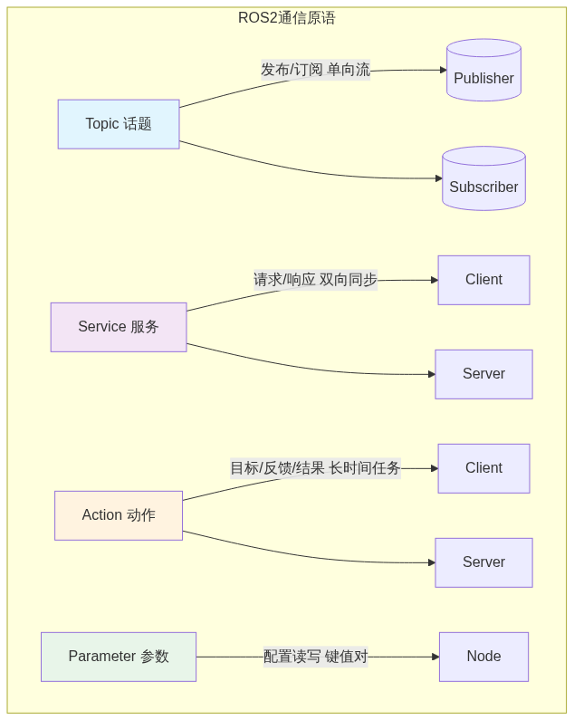


#### Topic（话题）
- **模式**：发布/订阅，单向数据流
- **特点**：异步、持续推送、多对多
- **类比**：YouTube 频道——博主发布视频，订阅者自动收到
- **本系统用例**：`/scan`（激光数据）、`/cmd_vel`（速度指令）、`/map`（地图）

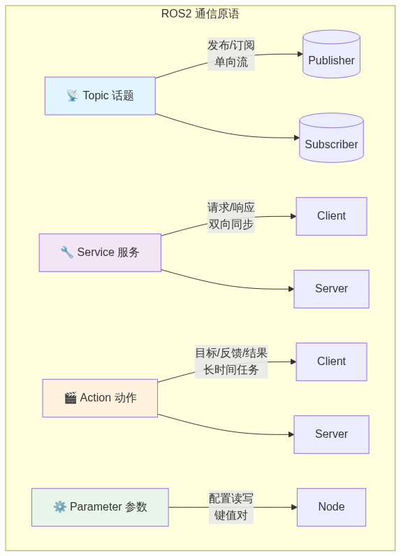

#### Service（服务）
- **模式**：请求/响应，双向同步
- **特点**：客户端发送请求，服务端返回结果，阻塞等待
- **类比**：打电话——你说一句，对方回一句
- **本系统用例**：`/slam_toolbox/save_map`（保存地图）、`/slam_toolbox/serialize_map`（序列化地图）

#### Action（动作）
- **模式**：目标/反馈/结果，适合长时间任务
- **特点**：可以中途获取进度反馈，可以取消
- **类比**：外卖订单——下单后能看到配送进度
- **本系统用例**：当前 SLAM 系统未使用 Action

#### Parameter（参数）
- **模式**：键值对配置
- **特点**：运行时可读写，支持类型检查
- **类比**：手机设置——亮度、音量可以随时调整
- **本系统用例**：`/slam_toolbox` 的 70+ 个配置参数

### 2.2 节点（Node）与启动文件（Launch）


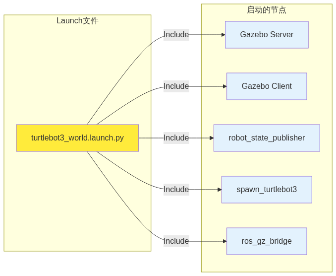


**Launch 文件**是 ROS2 的"编排脚本"，用 Python 编写，负责：
1. 配置参数
2. 启动多个节点
3. 管理节点生命周期

---

## 3. 项目架构总览

### 3.1 系统架构图

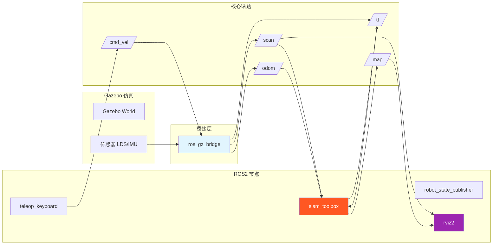


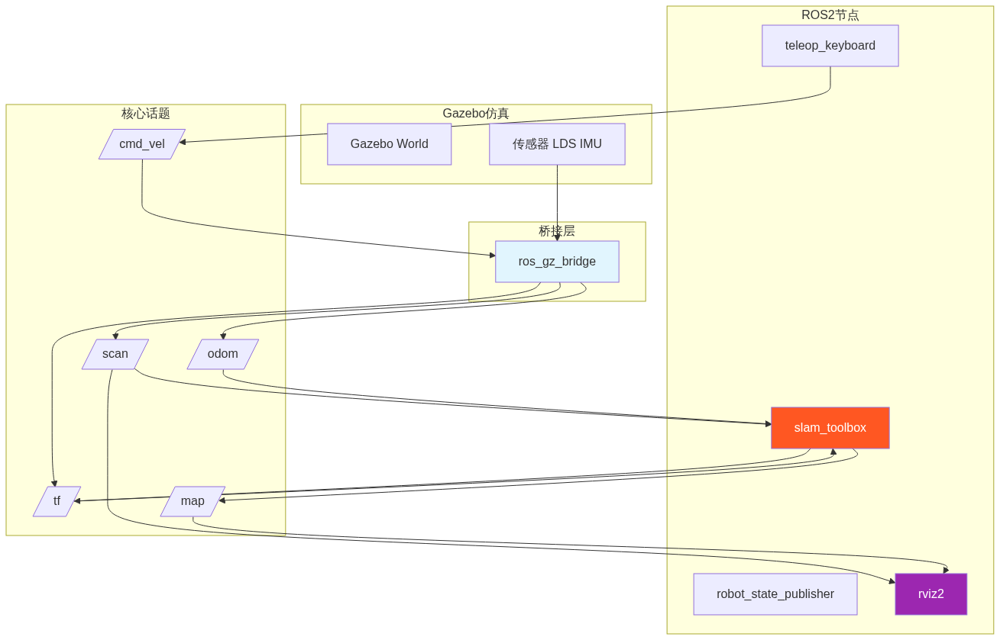


### 3.2 项目目录结构

```
turtlebot3_simulations/
├── turtlebot3_gazebo/           # Gazebo 仿真包
│   ├── launch/                  # 启动文件
│   │   ├── turtlebot3_world.launch.py    # 主启动文件（世界场景）
│   │   ├── robot_state_publisher.launch.py  # 机器人状态发布
│   │   └── spawn_turtlebot3.launch.py    # 生成机器人模型
│   ├── worlds/                  # Gazebo 世界文件
│   │   └── turtlebot3_world.world        # 带障碍物的世界
│   ├── models/                  # Gazebo 模型
│   │   ├── turtlebot3_burger/   # Burger 机器人模型
│   │   │   └── model.sdf                # SDF 格式模型定义
│   │   └── turtlebot3_burger_bridge.yaml # 桥接配置
│   └── rviz/                    # RViz 配置
│
├── slam_toolbox/                # SLAM 核心算法包
│   ├── launch/
│   │   ├── online_sync_launch.py      # 在线同步建图
│   │   └── online_async_launch.py     # 在线异步建图
│   ├── config/
│   │   └── mapper_params_online_sync.yaml  # 建图参数
│   └── src/                     # C++ 源码
│       ├── slam_toolbox_node.cpp      # 主节点
│       └── map_builder.cpp            # 地图构建器
│
├── turtlebot3_fake_node/        # 无 Gazebo 的纯仿真节点
│   └── launch/
│       └── fake_node.launch.py
│
├── turtlebot3_ws/src/           # 工作空间源码
│   ├── turtlebot3/              # TurtleBot3 官方包
│   │   ├── turtlebot3_node/     # 硬件驱动节点
│   │   ├── turtlebot3_bringup/  # 启动配置
│   │   ├── turtlebot3_cartographer/  # Cartographer SLAM
│   │   ├── turtlebot3_navigation2/   # 导航栈
│   │   └── turtlebot3_teleop/   # 键盘控制
│   └── utils/
│       ├── DynamixelSDK/        # 舵机驱动
│       └── hls_lfcd_lds_driver/ # 激光雷达驱动
│
└── turtlebot3_simulations.sh    # Docker 管理脚本
```

### 3.3 当前运行状态快照

以下是系统在运行时的实际采集数据：

**运行中的节点（8个）**：
| 节点名称 | 功能 | 类型 |
|---------|------|------|
| `/ros_gz_bridge` | Gazebo ↔ ROS2 消息桥接 | 核心桥接 |
| `/slam_toolbox` (×2) | SLAM 建图（Lifecycle Node） | 算法核心 |
| `/teleop_twist_keyboard` | 键盘速度控制 | 输入设备 |
| `/rviz2` | 3D 可视化 | 显示终端 |
| `/robot_state_publisher` | URDF → TF 变换 | 坐标发布 |
| `/transform_listener_impl_*` (×3) | TF 监听器 | 坐标监听 |

**活跃话题（25个）**：
| 话题 | 消息类型 | 发布者数 | 订阅者数 | 说明 |
|------|---------|---------|---------|------|
| `/scan` | `sensor_msgs/LaserScan` | 2 | 4 | 激光雷达扫描数据 |
| `/cmd_vel` | `geometry_msgs/TwistStamped` | 1 | 2 | 速度控制指令 |
| `/odom` | `nav_msgs/Odometry` | 2 | 1 | 里程计数据 |
| `/map` | `nav_msgs/OccupancyGrid` | 2 | 3 | 栅格地图 |
| `/tf` | `tf2_msgs/TFMessage` | 8 | 3 | 动态坐标变换 |
| `/tf_static` | `tf2_msgs/TFMessage` | 8 | 3 | 静态坐标变换 |
| `/clock` | `rosgraph_msgs/Clock` | - | - | 仿真时钟 |
| `/joint_states` | `sensor_msgs/JointState` | - | - | 关节状态 |
| `/imu` | `sensor_msgs/Imu` | - | - | IMU 数据 |

---

## 4. 系统启动流程详解

### 4.1 启动时序图

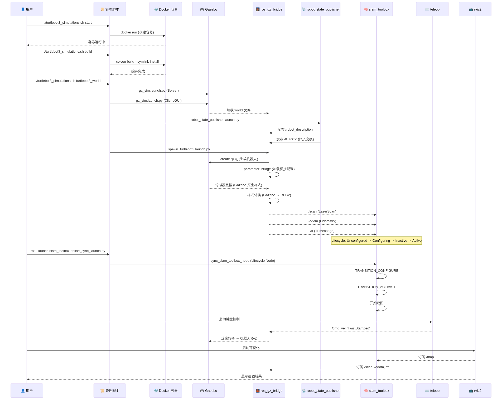


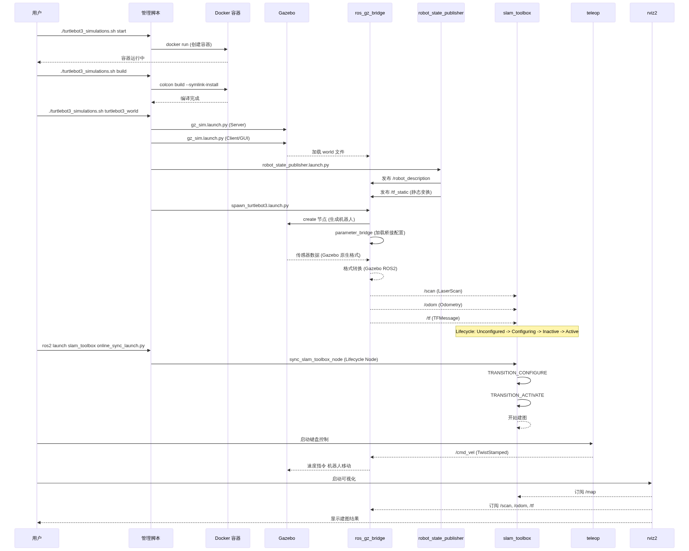


### 4.2 每个启动步骤在做什么？

#### Step 1: Gazebo Server (`gz_sim.launch.py` with `-s`)

```python
# turtlebot3_world.launch.py 片段
gzserver_cmd = IncludeLaunchDescription(
    PythonLaunchDescriptionSource(
        os.path.join(ros_gz_sim, 'launch', 'gz_sim.launch.py')
    ),
    launch_arguments={'gz_args': ['-r -s -v2 ', world]}.items()
)
```

| 参数 | 含义 |
|------|------|
| `-r` | 加载完成后立即运行 |
| `-s` | 仅启动 Server（无 GUI，物理引擎+传感器） |
| `-v2` | 日志级别为 2（信息级） |

**Gazebo Server 做的事**：
- 加载 `.world` 文件（定义环境、光照、障碍物）
- 启动物理引擎（ODE 引擎，计算碰撞、摩擦力）
- 运行传感器插件（LDS-01 激光雷达、IMU、轮式编码器）

#### Step 2: Gazebo Client (`gz_sim.launch.py` with `-g`)

```python
gzclient_cmd = IncludeLaunchDescription(
    PythonLaunchDescriptionSource(
        os.path.join(ros_gz_sim, 'launch', 'gz_sim.launch.py')
    ),
    launch_arguments={'gz_args': '-g -v2 '}.items()
)
```

| 参数 | 含义 |
|------|------|
| `-g` | 仅启动 GUI（3D 渲染窗口） |

#### Step 3: robot_state_publisher

```python
Node(
    package='robot_state_publisher',
    executable='robot_state_publisher',
    parameters=[{
        'use_sim_time': use_sim_time,  # 使用 Gazebo 时钟
        'robot_description': robot_desc,  # URDF 模型描述
    }]
)
```

**robot_state_publisher 做的事**：
1. 读取 URDF 文件（机器人运动学模型）
2. 监听 `/joint_states` 话题
3. 根据关节角度计算 TF 变换
4. 发布到 `/tf` 和 `/tf_static`

**URDF 中定义的坐标系**（以 Burger 为例）：

```
base_footprint (地面投影点)
    └── base_link (机器人中心)
        ├── caster_back_link (后万向轮)
        ├── imu_link (IMU 传感器)
        ├── base_scan (激光雷达)
        └── wheel_left_link / wheel_right_link (左右轮)
```

#### Step 4: spawn_turtlebot3

```python
# 生成机器人到 Gazebo
Node(
    package='ros_gz_sim',
    executable='create',
    arguments=['-name', 'burger', '-file', urdf_path, '-x', '-2.0', '-y', '-0.5']
)

# 启动桥接
Node(
    package='ros_gz_bridge',
    executable='parameter_bridge',
    arguments=['--ros-args', '-p', f'config_file:={bridge_params}']
)
```

**桥接配置文件** (`turtlebot3_burger_bridge.yaml`) 定义了 Gazebo 话题与 ROS2 话题的映射：

| Gazebo 话题 | ROS2 话题 | 消息类型 | 方向 |
|------------|----------|---------|------|
| `/scan` | `/scan` | `sensor_msgs/LaserScan` | GZ → ROS |
| `/odom` | `/odom` | `nav_msgs/Odometry` | GZ → ROS |
| `/tf` | `/tf` | `tf2_msgs/TFMessage` | GZ → ROS |
| `/cmd_vel` | `/cmd_vel` | `geometry_msgs/TwistStamped` | ROS → GZ |
| `/joint_states` | `/joint_states` | `sensor_msgs/JointState` | GZ → ROS |
| `/imu` | `/imu` | `sensor_msgs/Imu` | GZ → ROS |
| `/clock` | `/clock` | `rosgraph_msgs/Clock` | GZ → ROS |

#### Step 5: slam_toolbox

```python
# online_sync_launch.py
start_sync_slam_toolbox_node = LifecycleNode(
    package='slam_toolbox',
    executable='sync_slam_toolbox_node',
    name='slam_toolbox',
    parameters=[slam_params_file, {'use_sim_time': True}]
)
```

**slam_toolbox 是 Lifecycle Node（生命周期节点）**，有四个状态：

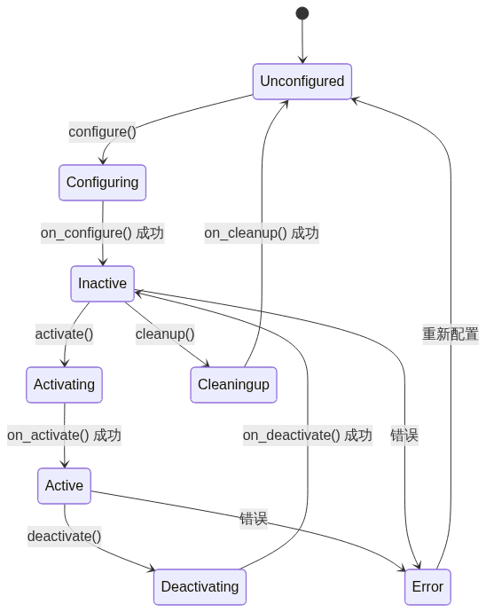


| 状态 | 含义 |
|------|------|
| **Unconfigured** | 刚启动，未加载参数 |
| **Configuring** | 加载参数文件（mapper_params_online_sync.yaml） |
| **Inactive** | 参数加载完成，等待激活 |
| **Active** | 正常运行，开始接收激光扫描并建图 |

---

## 5. 节点（Node）深度解析

### 5.1 `/ros_gz_bridge` — Gazebo 与 ROS2 的翻译官


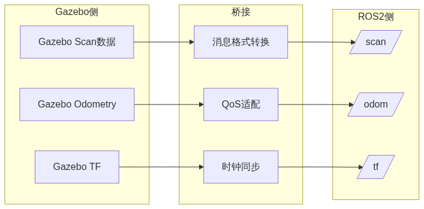


**为什么需要桥接？**

Gazebo 使用自己的消息格式（`gz.msgs.LaserScan`），而 ROS2 使用 `sensor_msgs/LaserScan`。桥接节点负责：
1. **格式转换**：Gazebo 消息 → ROS2 消息
2. **QoS 适配**：确保可靠性和持久性匹配
3. **时钟同步**：使用 Gazebo 仿真时钟（`use_sim_time:=true`）

### 5.2 `/slam_toolbox` — 建图的大脑

**slam_toolbox** 是基于 **2D 激光扫描匹配** 的 SLAM 算法库，核心组件：

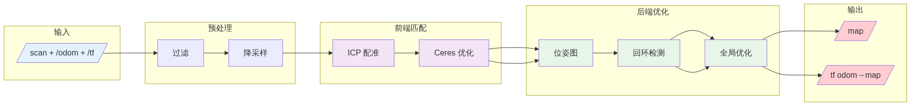


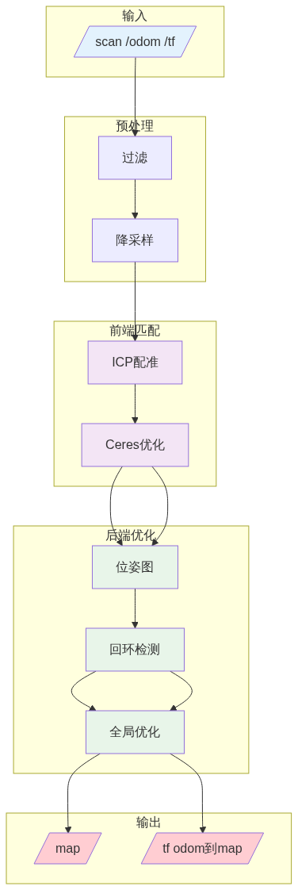


#### 核心算法流程

```
每次收到新的 /scan 数据:
1. 预处理
   ├── 裁剪激光范围 [min_laser_range, max_laser_range]
   ├── 降采样 (throttle_scans: 每隔 N 帧处理一次)
   └── 计算扫描重心 (use_scan_barycenter)

2. 扫描匹配 (Scan Matching)
   ├── 使用 odom 作为初始位姿估计
   ├── Scan-to-Scan: 与上一帧做 ICP 配准
   └── 优化: 最小化点到点的距离误差
       目标函数: min Σ ||p_i - T(q)||²
       优化器: Ceres Solver (Levenberg-Marquardt)

3. 添加到图 (Graph Insertion)
   ├── 添加新节点到位姿图
   ├── 检查是否满足关键帧条件:
   │   ├── minimum_travel_distance (默认 0.5m)
   │   └── minimum_travel_heading (默认 0.5rad)
   └── 满足条件 → 添加到子图

4. 回环检测 (Loop Closure)
   ├── 搜索附近的历史扫描 (loop_search_maximum_distance)
   ├── 粗匹配: 大角度步长搜索 (coarse_angle_resolution)
   ├── 精匹配: 小范围精细搜索 (fine_search_angle_offset)
   └── 匹配得分 > 阈值 → 添加回环约束

5. 全局优化 (Global Optimization)
   ├── 求解位姿图优化问题
   ├── 更新所有历史位姿
   └── 发布新的 odom→map 变换

6. 地图更新 (Map Update)
   ├── 根据优化后的位姿生成 Occupancy Grid
   └── 发布到 /map 话题 (map_update_interval)
```

### 5.3 `/teleop_twist_keyboard` — 键盘遥控器

```
键盘布局 (小键盘模式):
         u    i    o
         j    k    l
         m    ,    .

    u/o : 前进 + 转向
    j/l : 纯转向
    m/. : 后退 + 转向
    k   : 停止
    ,   : 慢速模式切换
```

**发布的消息格式** (`geometry_msgs/TwistStamped`):

```yaml
header:
  stamp: <当前时间>
  frame_id: ""
twist:
  linear:
    x: 0.22    # 前进速度 (m/s)
    y: 0.0     # 横向速度 (m/s)
    z: 0.0     # 垂直速度 (m/s)
  angular:
    x: 0.0     # 滚转 (rad/s)
    y: 0.0     # 俯仰 (rad/s)
    z: 2.0     # 偏航角速度 (rad/s)
```

### 5.4 `/robot_state_publisher` — 坐标变换计算器

**工作原理**：


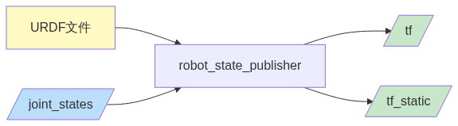


**发布的静态 TF 变换**（实际采集数据）：

```yaml
transforms:
  - frame_id: /base_footprint
    child_frame_id: /base_link
    transform:
      translation: {x: 0.0, y: 0.0, z: 0.01}  # 离地 1cm
      rotation: {w: 1.0}  # 无旋转
      
  - frame_id: /base_link
    child_frame_id: /caster_back_link
    transform:
      translation: {x: -0.081, y: 0.0, z: -0.004}
      rotation: {x: -0.707, w: 0.707}  # 万向轮朝向
      
  - frame_id: /base_link
    child_frame_id: /imu_link
    # ... IMU 位置
      
  - frame_id: /base_link
    child_frame_id: /base_scan
    # ... 激光雷达位置
```

---

## 6. 话题（Topic）数据流

### 6.1 完整数据流图

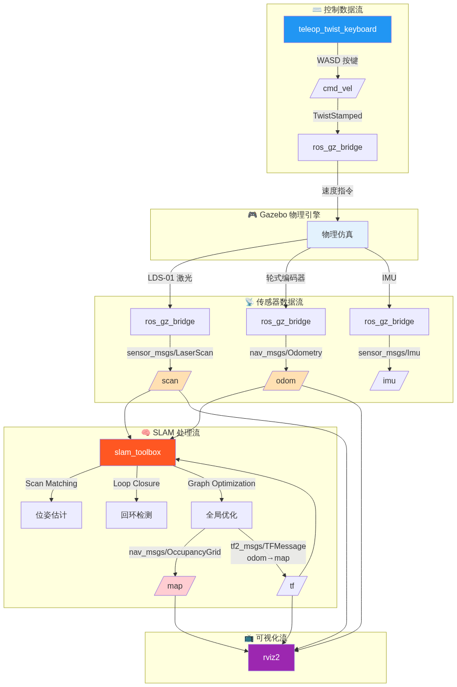


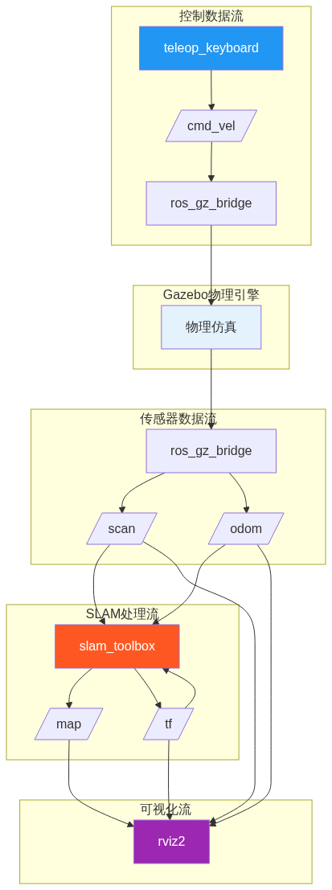


### 6.2 核心话题消息详解

#### `/scan` — 激光雷达扫描数据

**消息类型**: `sensor_msgs/msg/LaserScan`

```yaml
header:
  stamp: {sec: 30, nanosec: 400000000}  # 仿真时间 30.4s
  frame_id: base_scan                    # 激光雷达坐标系
angle_min: 0.0                           # 起始角度 (rad)
angle_max: 6.28                          # 结束角度 (rad) = 360°
angle_increment: 0.0175                  # 角度分辨率 (rad) ≈ 1°
time_increment: 0.0                      # 单点时间间隔 (仿真中为0)
scan_time: 0.0                           # 扫描周期 (仿真中为0)
range_min: 0.12                          # 最小有效距离 (m)
range_max: 3.5                           # 最大有效距离 (m)
ranges: [2.90, 2.84, 2.81, ...]         # 距离数组 (360个点)
```

**可视化**：

```
         0° (前方)
          ↑
    2.90m | 1.34m
         / \
   2.81 /   \ 1.37
       | 🤖  |  ← 障碍物 (右侧 1.3m)
  2.79 \     / 2.74
       \   /
   2.77 \ / 2.73
        ↓
     base_scan
```

#### `/cmd_vel` — 速度控制指令

**消息类型**: `geometry_msgs/msg/TwistStamped`

```yaml
header:
  stamp: {sec: 30, nanosec: 500000000}
twist:
  linear:
    x: 0.22   # 前进 0.22 m/s
    y: 0.0
    z: 0.0
  angular:
    x: 0.0
    y: 0.0
    z: 1.0    # 逆时针旋转 1.0 rad/s ≈ 57°/s
```

#### `/odom` — 里程计数据

**消息类型**: `nav_msgs/msg/Odometry`

```yaml
header:
  frame_id: odom          # 里程计坐标系 (世界固定点)
child_frame_id: base_footprint  # 机器人坐标系

pose:
  pose:
    position: {x: -1.8, y: -0.3, z: 0.0}   # 当前位置
    orientation: {x: 0, y: 0, z: 0.1, w: 0.995}  # 偏航角 ≈ 11°
  covariance: [...]    # 位姿协方差 (不确定性)

twist:
  twist:
    linear: {x: 0.22, y: 0.0, z: 0.0}     # 当前线速度
    angular: {x: 0.0, y: 0.0, z: 1.0}     # 当前角速度
  covariance: [...]    # 速度协方差
```

#### `/map` — 栅格地图

**消息类型**: `nav_msgs/msg/OccupancyGrid`

```yaml
header:
  frame_id: map
info:
  map_load_time: ...
  resolution: 0.05       # 每格 5cm
  width: 400             # 400 格 = 20m
  height: 400            # 400 格 = 20m
  origin:
    position: {x: -10.0, y: -10.0, z: 0.0}
    orientation: {w: 1.0}
data: [0, 0, 100, -1, ...]  # 栅格值数组
```

**栅格值含义**：
| 值 | 含义 | 颜色 (RViz) |
|----|------|------------|
| `0` | 空闲 (无障碍) | 白色 |
| `100` | 占用 (有障碍) | 黑色 |
| `-1` | 未知 (未探测) | 灰色 |

**地图可视化示例**（10×10 简化版）：

```
     y
     ↑
  9  | . . . . . . . . . .
  8  | . . # # # . . . . .
  7  | . . # . # . . . . .
  6  | . . # # # . . . . .
  5  | . . . . . . . . . .
  4  | . . . . . . . # . .
  3  | . . . . . . . # . .
  2  | . . . . . . . . . .
  1  | . . S . . . . . . .
  0  | . . . . . . . . . .
     +-------------------→ x
     0 1 2 3 4 5 6 7 8 9

  . = 空闲 (0)
  # = 占用 (100)
  S = 起点 (Start)
```

### 6.3 话题发布/订阅关系矩阵


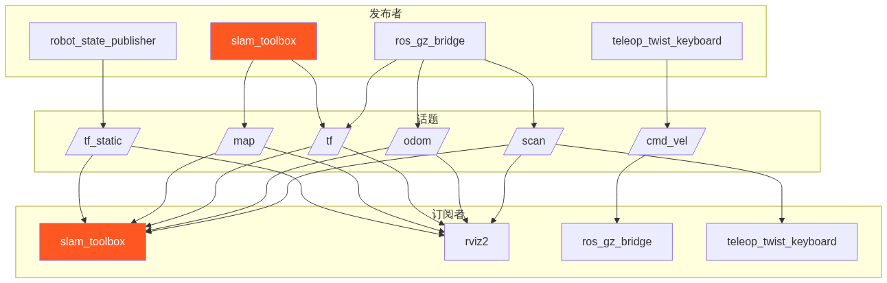


---

## 7. 服务（Service）与参数

### 7.1 slam_toolbox 服务列表

| 服务名 | 服务类型 | 用途 | 调用示例 |
|--------|---------|------|---------|
| `/slam_toolbox/save_map` | `nav2_msgs/SaveMap` | 保存地图为 PNG + YAML | `ros2 service call /slam_toolbox/save_map ...` |
| `/slam_toolbox/serialize_map` | `slam_toolbox/SerializePoseGraph` | 序列化位姿图（用于后续定位） | 保存 `.posegraph` 文件 |
| `/slam_toolbox/dynamic_map` | `nav_msgs/GetMap` | 获取当前地图 | `ros2 service call /slam_toolbox/dynamic_map nav_msgs/srv/GetMap` |
| `/slam_toolbox/manual_loop_closure` | `slam_toolbox/LoopClosure` | 手动触发回环检测 | 交互式模式下使用 |
| `/slam_toolbox/clear_changes` | `std_srvs/Empty` | 清除未保存的更改 | 重置修改 |
| `/slam_toolbox/reset` | `std_srvs/Empty` | 重置整个 SLAM 状态 | 重新开始建图 |
| `/slam_toolbox/change_state` | `lifecycle_msgs/ChangeState` | 生命周期状态切换 | `transition_id: 2` (激活) |
| `/slam_toolbox/get_state` | `lifecycle_msgs/GetState` | 获取当前生命周期状态 | 查看节点状态 |

### 7.2 关键参数详解

#### 建图参数 (`mapper_params_online_sync.yaml`)

```yaml
slam_toolbox:
  ros__parameters:
    # ========== 优化器配置 ==========
    solver_plugin: solver_plugins::CeresSolver    # 使用 Ceres 优化器
    ceres_linear_solver: SPARSE_NORMAL_CHOLESKY   # 稀疏矩阵求解器
    ceres_preconditioner: SCHUR_JACOBI            # 预条件器 (加速收敛)
    ceres_trust_strategy: LEVENBERG_MARQUARDT     # 信任区域策略
    ceres_dogleg_type: TRADITIONAL_DOGLEG         # Dogleg 类型
    ceres_loss_function: None                     # 损失函数 (无)
```

**为什么需要 Ceres Solver？**

SLAM 的扫描匹配本质上是一个**非线性最小二乘问题**：

```
min Σ ||z_i - h(x_i)||²_Σ
```

Ceres Solver 是 Google 开发的非线性优化库，专门求解这类问题。

```yaml
    # ========== 坐标系配置 ==========
    odom_frame: odom          # 里程计坐标系 (固定在世界原点)
    map_frame: map            # 地图坐标系 (SLAM 输出)
    base_frame: base_footprint # 机器人基坐标系
    scan_topic: /scan         # 激光雷达话题
    mode: mapping             # 建图模式 (另一个模式是 localization)
```

**坐标系关系（TF Tree）**：


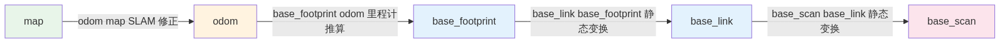


```yaml
    # ========== 地图输出配置 ==========
    use_map_saver: true               # 启用地图保存服务
    resolution: 0.05                  # 地图分辨率 (5cm/格)
    map_update_interval: 5.0          # 地图更新频率 (5秒)
    occupancy_threshold: 0.1          # 占用阈值
```

```yaml
    # ========== 扫描匹配配置 ==========
    use_scan_matching: true           # 启用扫描匹配
    use_scan_barycenter: true         # 使用扫描重心 (提高匹配稳定性)
    throttle_scans: 1                 # 每帧都处理 (设为2则隔帧处理)
    
    # 关键帧选择
    minimum_travel_distance: 0.5      # 至少移动 0.5m 才添加关键帧
    minimum_travel_heading: 0.5       # 至少旋转 0.5rad ≈ 29° 才添加关键帧
    minimum_time_interval: 0.5        # 至少间隔 0.5 秒
    
    # 扫描缓冲区
    scan_buffer_size: 10              # 保留最近 10 个扫描用于匹配
    scan_buffer_maximum_scan_distance: 10.0  # 最大匹配距离
```

```yaml
    # ========== 回环检测配置 ==========
    do_loop_closing: true             # 启用回环检测
    
    # 回环搜索
    loop_search_maximum_distance: 3.0       # 搜索 3m 内的历史扫描
    loop_match_minimum_chain_size: 10       # 至少 10 个连续匹配才触发
    loop_match_minimum_response_coarse: 0.35 # 粗匹配最低得分
    loop_match_minimum_response_fine: 0.45   # 精匹配最低得分
```

```yaml
    # ========== 相关性搜索空间 ==========
    correlation_search_space_dimension: 0.5      # 搜索空间大小 (0.5m)
    correlation_search_space_resolution: 0.01    # 搜索分辨率 (1cm)
    correlation_search_space_smear_deviation: 0.1 # 平滑偏差
```

```yaml
    # ========== 惩罚参数 ==========
    distance_variance_penalty: 0.5    # 距离惩罚 (越大越倾向于少移动)
    angle_variance_penalty: 1.0       # 角度惩罚 (越大越倾向于少旋转)
    
    # 搜索策略
    fine_search_angle_offset: 0.00349     # 精搜索角度偏移 (0.2°)
    coarse_search_angle_offset: 0.349     # 粗搜索角度偏移 (20°)
    coarse_angle_resolution: 0.0349       # 粗搜索角度分辨率 (2°)
    minimum_angle_penalty: 0.9            # 最小角度惩罚
    minimum_distance_penalty: 0.5         # 最小距离惩罚
    use_response_expansion: true          # 启用响应扩展 (提高鲁棒性)
```

### 7.3 参数调优速查表

| 问题现象 | 调整参数 | 调整方向 | 原因 |
|---------|---------|---------|------|
| 地图漂移/重影 | `minimum_travel_distance` ↓ | 减小到 0.2-0.3 | 关键帧太少，插值不准确 |
| 建图卡顿 | `throttle_scans` ↑ | 增大到 2-3 | 处理频率太高，CPU 跟不上 |
| 回环检测失败 | `loop_search_maximum_distance` ↑ | 增大到 5-10 | 搜索范围太小，找不到历史匹配 |
| 地图分辨率太低 | `resolution` ↓ | 减小到 0.02-0.03 | 5cm/格太粗糙 |
| 激光数据异常值干扰 | `max_laser_range` ↓ | 根据实际环境设置 | 过滤超距噪声 |
| 位姿跳变 | `transform_timeout` ↑ | 增大到 0.5 | TF 缓冲时间不足 |

---

## 8. TF 坐标变换系统

### 8.1 TF 是什么？

**TF (Transform)** 是 ROS 的坐标变换系统，维护一个**坐标系树**，可以在任意两个坐标系之间进行位置和姿态的转换。

```
想象一个机器人：
- 激光雷达安装在机器人顶部，偏移 (0, 0, 0.1)
- IMU 安装在中心，偏移 (0, 0, 0.05)
- 轮子在底部，偏移 (0, 0, -0.05)

当激光雷达看到障碍物在 (1.0, 0.5, 0) 时，
我们需要知道"这个障碍物在机器人坐标系中在哪？"
→ 这就是 TF 做的事：坐标变换
```

### 8.2 本系统的 TF 树


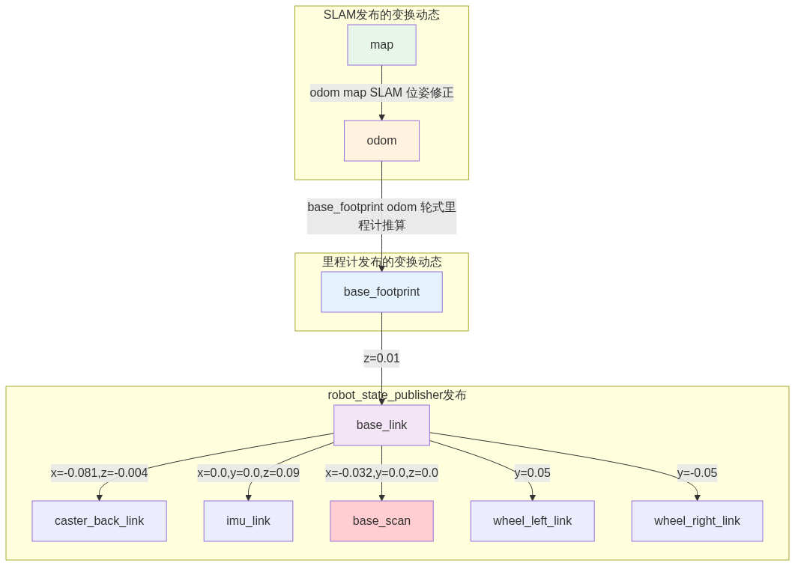


### 8.3 为什么需要 odom→map 变换？


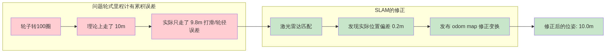


**核心思想**：
- `odom → base_footprint`：由轮式里程计计算，**精确但有累积误差**
- `map → odom`：由 SLAM 计算，**修正累积误差**
- 两者结合：`map → base_footprint = (map → odom) × (odom → base_footprint)`

### 8.4 实际 TF 数据分析

从实际系统采集的 `/tf_static` 数据：

```yaml
transforms:
  - header:
      frame_id: /base_footprint
    child_frame_id: /base_link
    transform:
      translation: {x: 0.0, y: 0.0, z: 0.01}  # 基座离地 1cm
      rotation: {x: 0.0, y: 0.0, z: 0.0, w: 1.0}  # 无旋转
      
  - header:
      frame_id: /base_link
    child_frame_id: /caster_back_link
    transform:
      translation: {x: -0.081, y: 0.0, z: -0.004}  # 后万向轮
      rotation: {x: -0.707, y: 0.0, z: 0.0, w: 0.707}  # 旋转 90°
```

**理解旋转四元数**：
```
四元数 (x, y, z, w) = (0, 0, sin(θ/2), cos(θ/2))
对于 90° 绕 X 轴旋转:
  θ = π/2
  sin(π/4) = 0.707
  cos(π/4) = 0.707
  → (0.707, 0, 0, 0.707) 或 (-0.707, 0, 0, 0.707)
```

---

## 9. slam_toolbox 核心算法

### 9.1 同步 vs 异步模式

| 特性 | 同步模式 (`online_sync`) | 异步模式 (`online_async`) |
|------|------------------------|------------------------|
| 处理方式 | 阻塞等待扫描处理完成 | 非阻塞，后台线程处理 |
| 延迟 | 较高（等待优化完成） | 较低（立即返回） |
| 精度 | 较高（使用最新优化结果） | 略低（可能使用旧位姿） |
| CPU 占用 | 较高 | 较低 |
| 适用场景 | 建图精度要求高 | 实时性要求高 |

**本教程使用同步模式**，因为仿真环境对实时性要求不高，更注重建图质量。

### 9.2 扫描匹配算法详解

#### 9.2.1 ICP (Iterative Closest Point) 算法


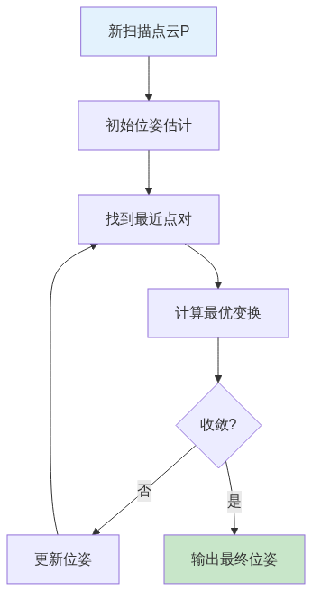


**数学公式**：

```
目标函数: min_ΔT Σ ||p_i - ΔT(q_i)||²

其中:
  p_i ∈ P (新扫描点)
  q_i ∈ Q (参考扫描点)
  ΔT = [R|t] (旋转 + 平移)
  
Ceres Solver 求解:
  使用 Levenberg-Marquardt 算法
  迭代更新 ΔT 直到收敛
```

#### 9.2.2 扫描匹配可视化

```
参考扫描 (黑色)          新扫描 (红色)          匹配后 (绿色)
    |                        .                      .
   .#.                      .#.                    .#.
  .###.                    .###.                  .###.
 .####.      +    ##    =  .####.    →   →       .####.
  .###.          ##         .###.                .####.
   .#.                       .#.                  .#.
    |                         .                    .
    
未匹配 ← 初始偏差大    →  优化迭代中  →  收敛 (位姿确定)
```

### 9.3 回环检测算法


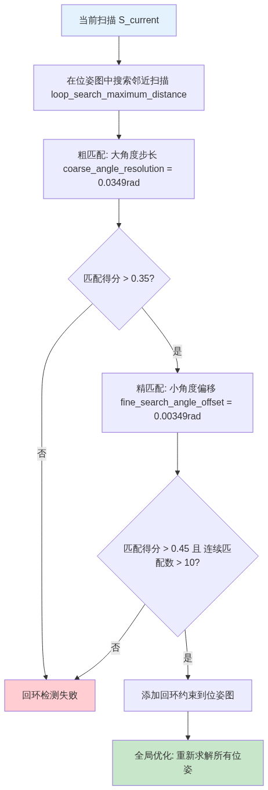


**回环检测的意义**：

```
机器人走了一圈回到起点:

错误累积的轨迹 (无回环):
    ┌──────────┐
    │          │
    │    →     │  ← 偏差越来越大
    │          │
    └──────────┘
    ↑
  起点 ≠ 终点 (漂移)

回环检测修正后:
    ┌──────────┐
    │          │
    │    →     │
    │          │
    └──────────┘
    ↑
  起点 = 终点 (闭合)
```

### 9.4 位姿图优化

```
位姿图 (Pose Graph) 由两部分组成:

节点 (Nodes): 机器人在每个时刻的位姿 (x, y, θ)
    x₀ ─── x₁ ─── x₂ ─── x₃ ─── ...

边 (Edges): 位姿之间的约束关系
    ├── 里程计约束 (xᵢ → xᵢ₊₁)
    └── 回环约束 (xᵢ → xⱼ, 当检测到回环时)

优化目标:
    min Σ ||z_ij - h(x_i, x_j)||²_Ω
    
    其中:
        z_ij = 观测到的相对位姿
        h(x_i, x_j) = 预测的相对位姿
        Ω = 信息矩阵 (权重)
```

---

## 10. 实战：从零开始建图

### 10.1 环境准备

```bash
# 1. 启动 Docker 容器
./turtlebot3_simulations.sh start

# 2. 编译项目
./turtlebot3_simulations.sh build

# 3. 诊断环境
./turtlebot3_simulations.sh diagnose
```

### 10.2 启动仿真和 SLAM

```bash
# 终端 1: 启动 Gazebo 世界
./turtlebot3_simulations.sh turtlebot3_world

# 终端 2: 启动 SLAM Toolbox
./turtlebot3_simulations.sh slam_toolbox_sync

# 终端 3: 启动键盘控制
./turtlebot3_simulations.sh teleop_twist_custom

# 终端 4: 启动 RViz2 可视化
docker exec -it turtlebot3-sim bash -c "
    source /opt/ros/jazzy/setup.bash
    cd /root/turtlebot3_ws && source install/setup.bash
    rviz2 -d /workspace/auto_slam.rviz
"
```

### 10.3 建图操作指南

#### 键盘控制说明

```
终端 3 中显示:
Control Your TurtleBot3!
---------------------------
Moving around:
        u    i    o
        j    k    l
        m    ,    .

w/x : increase/decrease linear velocity
a/d : increase/decrease angular velocity
space key, k : force stop
```

#### 建图步骤


#### 详细操作

```bash
# Step 1: 检查 SLAM 状态
ros2 lifecycle get /slam_toolbox
# 期望输出: state: active

# Step 2: 检查建图进度
ros2 topic echo /map_metadata --once
# 查看地图尺寸是否随时间增长

# Step 3: 观察 RViz2
# - LaserScan 点云应该贴合地图边缘
# - 机器人位姿应该平滑移动
# - 回环检测时地图会"跳变"修正

# Step 4: 保存地图
./turtlebot3_simulations.sh save_map my_map
# 生成: maps/my_map.pgm + maps/my_map.yaml
```

### 10.4 地图文件格式

保存后的地图包含两个文件：

**my_map.yaml** (地图元数据):
```yaml
image: my_map.pgm          # 地图图片文件
resolution: 0.050000       # 每格分辨率 (米)
origin: [-10.0, -10.0, 0.0] # 地图原点 (x, y, yaw)
negate: 0                  # 0 = 黑色为障碍, 1 = 反转
occupied_thresh: 0.65      # 占用阈值 (大于此值为障碍)
free_thresh: 0.196         # 空闲阈值 (小于此值为空闲)
```

**my_map.pgm** (地图图片):
```
PGM 格式 (便携式灰度图):
- 像素值 0 (黑色) = 占用
- 像素值 255 (白色) = 空闲
- 像素值 205 (灰色) = 未知
```

---

## 11. 进阶：参数调优与故障排查

### 11.1 常见问题诊断

#### 问题 1: SLAM 节点未激活

```bash
# 检查生命周期状态
ros2 lifecycle get /slam_toolbox
# 输出: state: unconfigured

# 手动激活
ros2 lifecycle set /slam_toolbox configure
ros2 lifecycle set /slam_toolbox activate

# 检查日志
ros2 topic echo /rosout --filter "m.node_name=='slam_toolbox'" | head -20
```

#### 问题 2: 激光数据不显示

```bash
# 检查 /scan 话题是否有数据
ros2 topic hz /scan
# 期望: ~10 Hz

# 检查消息内容
ros2 topic echo /scan --once | grep range

# 检查 TF 是否存在
ros2 run tf2_tools view_frames
# 打开 frames.pdf 查看 TF 树
```

#### 问题 3: 地图漂移严重

```yaml
# 调整 mapper_params_online_sync.yaml
minimum_travel_distance: 0.2    # 原 0.5 → 更频繁的关键帧
minimum_travel_heading: 0.3     # 原 0.5 → 更小的角度阈值
scan_buffer_size: 15            # 原 10 → 更大的缓冲区
```

#### 问题 4: 回环检测不触发

```yaml
# 放宽回环检测条件
loop_search_maximum_distance: 5.0          # 原 3.0 → 更大搜索范围
loop_match_minimum_chain_size: 8           # 原 10 → 更少的连续匹配要求
loop_match_minimum_response_coarse: 0.25   # 原 0.35 → 更低的粗匹配阈值
```

### 11.2 性能优化

#### CPU 占用过高

```yaml
# 降低处理频率
throttle_scans: 2              # 每隔 2 帧处理一次
map_update_interval: 10.0      # 每 10 秒更新一次地图 (原 5.0)

# 降低扫描匹配精度
correlation_search_space_resolution: 0.02  # 原 0.01
```

#### 地图太大导致内存溢出

```yaml
# 限制地图大小
stack_size_to_use: 80000000    # 原 40000000 → 80MB

# 定期保存并重置
ros2 service call /slam_toolbox/serialize_map ...
```

### 11.3 调试技巧

```bash
# 1. 查看节点图
ros2 run rqt_graph rqt_graph

# 2. 实时监控话题频率
ros2 topic hz /scan /odom /map

# 3. 查看 TF 变换
ros2 topic echo /tf --once | head -30

# 4. 导出诊断信息
ros2 doctor --report > doctor_report.txt

# 5. 查看 SLAM 内部状态
ros2 param list /slam_toolbox
ros2 param get /slam_toolbox interactive_mode
```

---

## 12. 扩展阅读

### 12.1 从 SLAM 到导航

建图完成后，下一步是**导航 (Navigation)**：


```bash
# 启动 Navigation2
./turtlebot3_simulations.sh turtlebot3_world   # 先启动仿真
ros2 launch turtlebot3_navigation2 navigation2.launch.py \
    map:=/path/to/my_map.yaml \
    use_sim_time:=true
```

### 12.2 其他 SLAM 算法对比

| 算法 | 传感器 | 特点 | 适用场景 |
|------|--------|------|---------|
| **slam_toolbox** | 2D 激光 | 轻量、易于调参 | 室内平面环境 |
| **Cartographer** | 2D/3D 激光 + IMU | Google 开发，支持多线雷达 | 大型室内外场景 |
| **ORB-SLAM3** | 单目/双目/深度相机 | 视觉特征点匹配 | 纹理丰富的环境 |
| **LIO-SAM** | 3D 激光 + IMU | 紧耦合激光惯性里程计 | 室外大场景 |
| **FAST-LIO2** | 3D 激光 + IMU | 高效紧耦合，支持固态雷达 | 无人机、自动驾驶 |

### 12.3 从仿真到真机


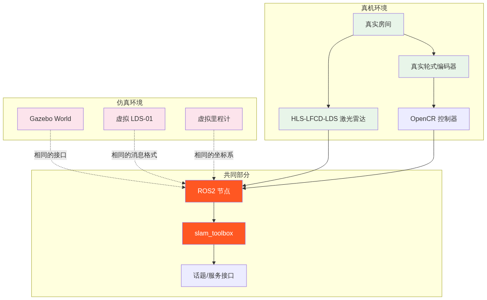


**关键差异**：
1. **传感器噪声**：真机激光雷达有噪声和异常值
2. **时钟同步**：真机需要 NTP 同步
3. **网络延迟**：真机 WiFi 可能丢包
4. **安全考虑**：真机需要急停和防撞机制

### 12.4 推荐学习资源

| 资源类型 | 名称 | 链接 |
|---------|------|------|
| **官方文档** | TurtleBot3 e-Manual | http://turtlebot3.robotis.com/ |
| **官方文档** | slam_toolbox Wiki | https://github.com/SteveMacenski/slam_toolbox |
| **视频教程** | ROS2 SLAM 教程 | https://www.youtube.com/@ROBOTISCHANNEL |
| **书籍** | 《Probabilistic Robotics》 | 作者：Sebastian Thrun |
| **课程** | Udacity Robotics Nanodegree | https://www.udacity.com/course/robotics-nanodegree--nd522 |
| **论文** | GMapping | http://ais.informatik.uni-freiburg.de/publications/papers/kuemmerle09icra.pdf |
| **论文** | Cartographer | https://storage.googleapis.com/cartographer-public-data/documents/cartographer_paper.pdf |

---

## 附录

### A. 术语表

| 术语 | 英文 | 解释 |
|------|------|------|
| SLAM | Simultaneous Localization and Mapping | 同时定位与建图 |
| TF | Transform | 坐标变换系统 |
| ICP | Iterative Closest Point | 迭代最近点算法 |
| QoS | Quality of Service | 服务质量（可靠性、持久性等） |
| URDF | Unified Robot Description Format | 统一机器人描述格式 |
| SDF | Simulation Description Format | 仿真描述格式 |
| Occupancy Grid | 占用栅格 | 用网格表示的地图 |
| Pose Graph | 位姿图 | 用图表示的位姿关系 |
| Loop Closure | 回环检测 | 识别曾经到过的位置 |
| Lifecycle Node | 生命周期节点 | 有状态管理的节点 |
| colcon | Common Logic for CONstruction | ROS2 构建工具 |

### B. 快捷命令速查表

```bash
# ========== 启动相关 ==========
./turtlebot3_simulations.sh start          # 启动容器
./turtlebot3_simulations.sh build          # 编译项目
./turtlebot3_simulations.sh turtlebot3_world  # 启动仿真
./turtlebot3_simulations.sh slam_toolbox_sync # 启动SLAM
./turtlebot3_simulations.sh teleop_twist_custom # 键盘控制

# ========== 诊断相关 ==========
ros2 node list                             # 列出所有节点
ros2 topic list -t                         # 列出所有话题及类型
ros2 service list                          # 列出所有服务
ros2 param list /slam_toolbox              # 列出SLAM参数
ros2 run tf2_tools view_frames             # 查看TF树

# ========== 调试相关 ==========
ros2 topic echo /scan --once               # 查看单次激光数据
ros2 topic hz /scan                        # 查看话题频率
ros2 topic info /cmd_vel -v                # 查看话题详情
ros2 lifecycle get /slam_toolbox           # 查看节点状态

# ========== 地图相关 ==========
./turtlebot3_simulations.sh save_map name  # 保存地图
ros2 service call /slam_toolbox/dynamic_map ... # 获取当前地图
```

### C. 消息类型速查表

| 消息类型 | 包 | 用途 |
|---------|-----|------|
| `sensor_msgs/LaserScan` | sensor_msgs | 2D 激光扫描 |
| `sensor_msgs/Imu` | sensor_msgs | IMU 数据 |
| `nav_msgs/Odometry` | nav_msgs | 里程计 |
| `nav_msgs/OccupancyGrid` | nav_msgs | 栅格地图 |
| `geometry_msgs/TwistStamped` | geometry_msgs | 速度指令 |
| `tf2_msgs/TFMessage` | tf2_msgs | 坐标变换 |
| `rosgraph_msgs/Clock` | rosgraph_msgs | 仿真时钟 |
| `sensor_msgs/JointState` | sensor_msgs | 关节状态 |

---

> **教程版本**: v1.0  
> **ROS2 版本**: Jazzy Jalisco  
> **Gazebo 版本**: Harmonic  
> **slam_toolbox 版本**: 2.3.7  
> **最后更新**: 2026-05-23  
> **采集数据**: 基于实际运行的 TurtleBot3 SLAM 系统
